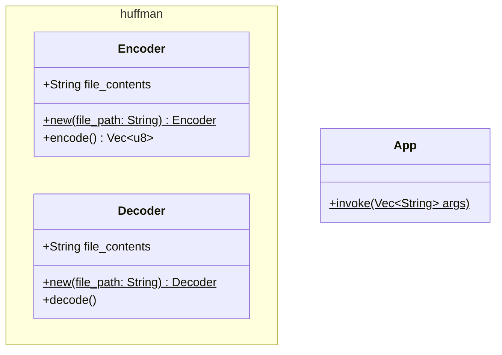

# The Object Universe

This document describes all of the objects that you might encounter in the
application. It is a class reference, essentially.

# Class Diagram

## App

Drives the app.

1. Receives program arguments and validates them
2. Determines what actions to take based on program args

There are only two main functions of the program, encoding and decoding.

Two classes exist which drive each process: `huffman::Encoder` and
`huffman::Decoder`.